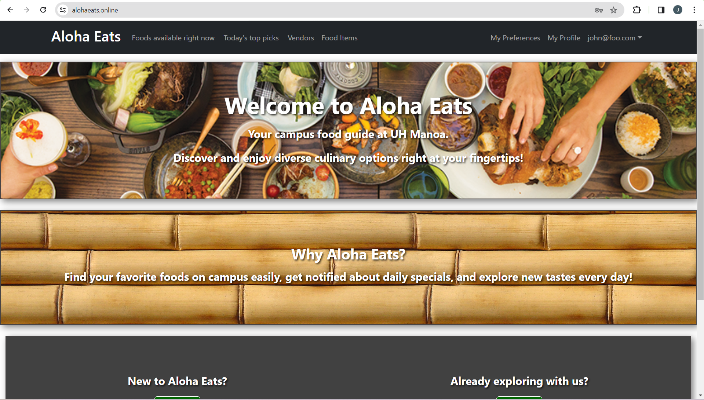
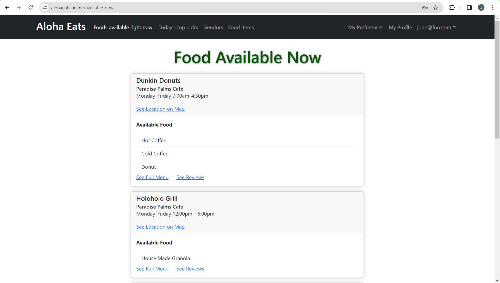
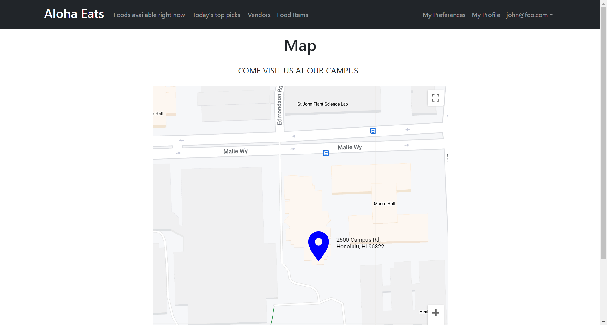
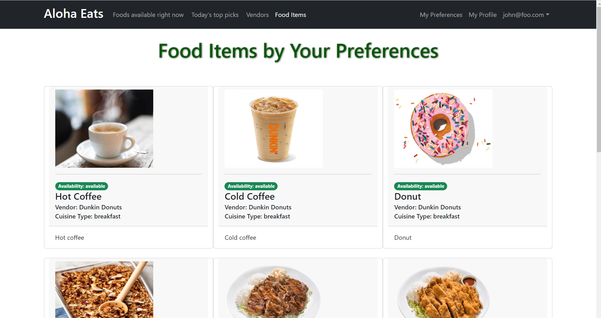

## Overview

For our final project in ICS 314, we were tasked with creating a web application that would be useful for students and food vendors on the UH Manoa campus. We decided to create a web application that would allow students to view food from various food vendors on campus. If a user registers and makes an account they can also set their food preferences or any dietary restrictions they have. Meaning they can filter out any food options that don't fit their desires. This web application would be useful for food vendors because vendors can register and account and post their food options on the website. This would help advertise to students or any other campus goers to view their food options and potentially increase their sales. 

A link to the application's project page: [Aloha Eats](https://manoamunchies.github.io/aloha-eats.github.io/)

## Contributions

My contributions to this project are the following:
* Create and keep project page up to date
* Made the map page and integrated Google Maps API onto it
* Created the Map and LocationPin components

## What I Learned

I learned a bunch of different things from this project. I learned how to use Meteor and React in tandem with a meteor-application-template-react template to create a web application. More specifically how to expand upon a template, using design patterns to expedite my programming. I also learned how to use Google Maps API and integrate it into a web application. I learned how to use GitHub and the project board to collaborate with other people on a project. I also learned how to use GitHub pages to create a project page for our web application. 

### Screenshots

    
    
    

