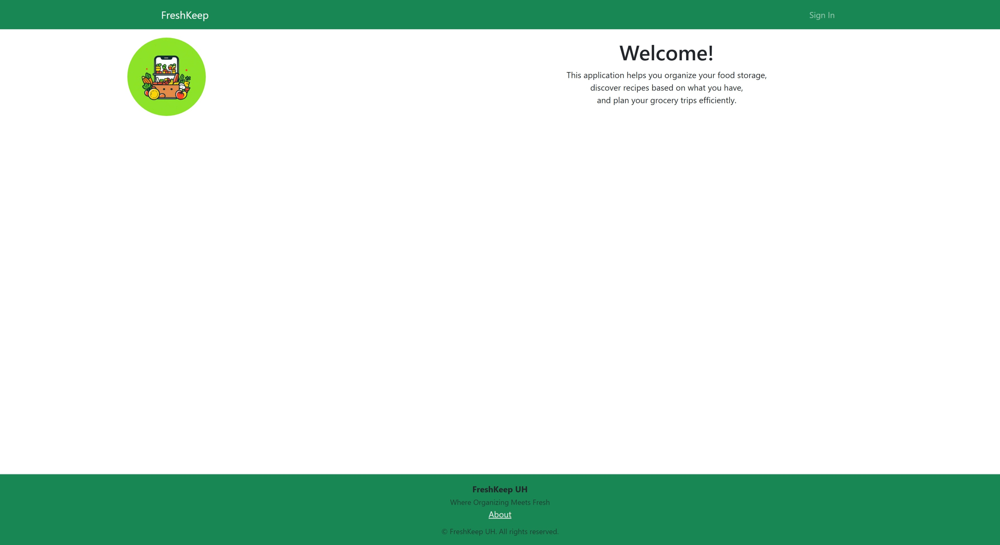

## Overview

FreshKeep is a full-stack web application built for ICS 414 to help users manage pantry inventory, reduce food waste, and keep track of product freshness across locations and storage areas. The app supports inventory tracking, expiration awareness, shopping lists, and user account management in one system.

A link to the application's live site (Not working): [FreshKeep](https://freshkeepuh.live)

A link to the project's documentation site: [FreshKeep Docs](https://freshkeepuh.github.io)

A link to the source code repository: [freshkeepuh/freshkeep](https://github.com/freshkeepuh/freshkeep)

## Project Features and Team Work

The project was delivered through milestone-based team collaboration and includes the following:
* A full authentication flow with sign up, sign in, password reset, and account settings.
* Pantry/inventory management across locations and storage areas with support for tracking freshness and expiration dates.
* Shopping list and planning workflows to help users convert inventory needs into actionable grocery lists.
* A full-stack architecture using Next.js, TypeScript, Prisma, and PostgreSQL, with API-driven data operations.
* End-to-end quality checks and continuous integration to validate page flows and stabilize releases.

## Project Outcomes

FreshKeep demonstrates how a student team can build and iterate on a production-style web application with a modern TypeScript stack. The project combines practical product goals (reducing food waste and improving organization) with software engineering practices such as incremental milestones, testing, and CI-based validation.

### Screenshots

  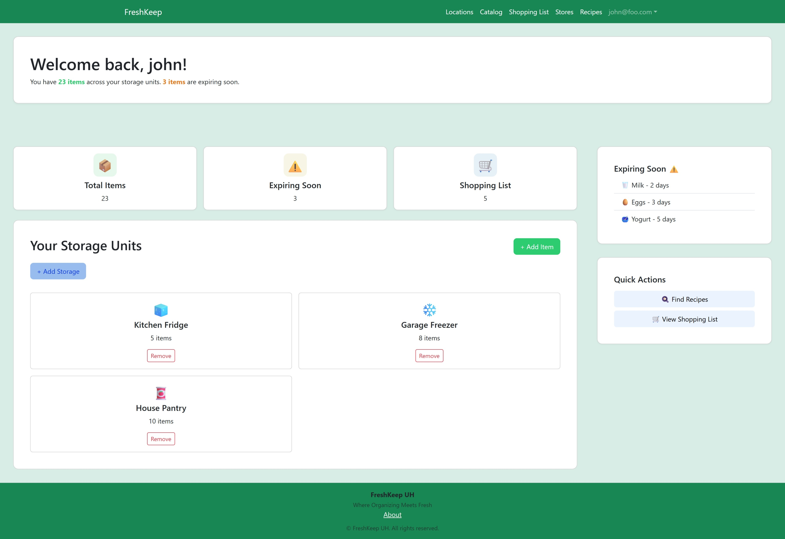
  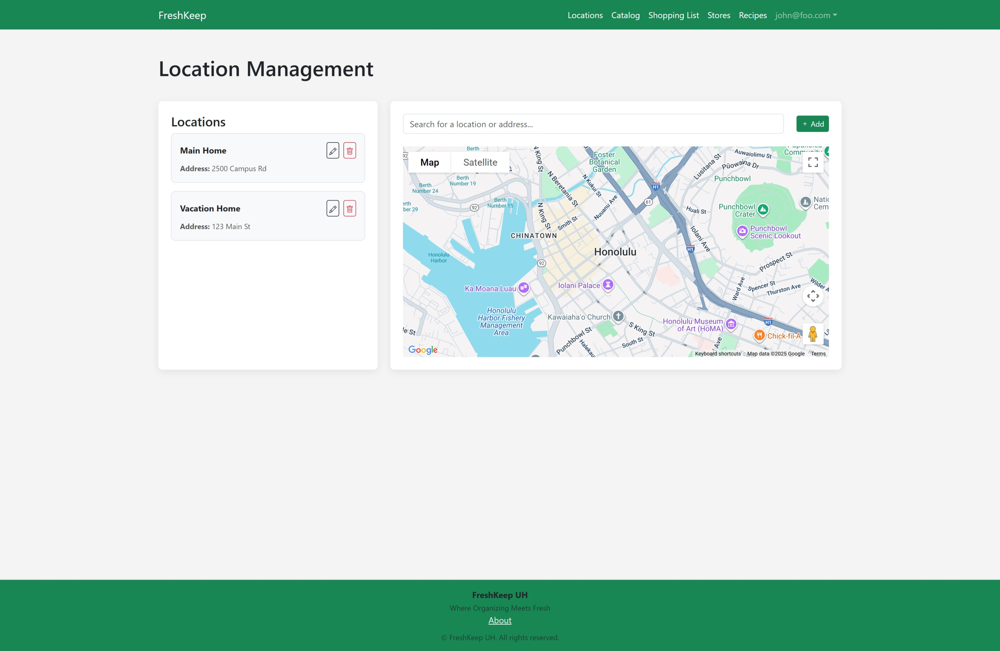
  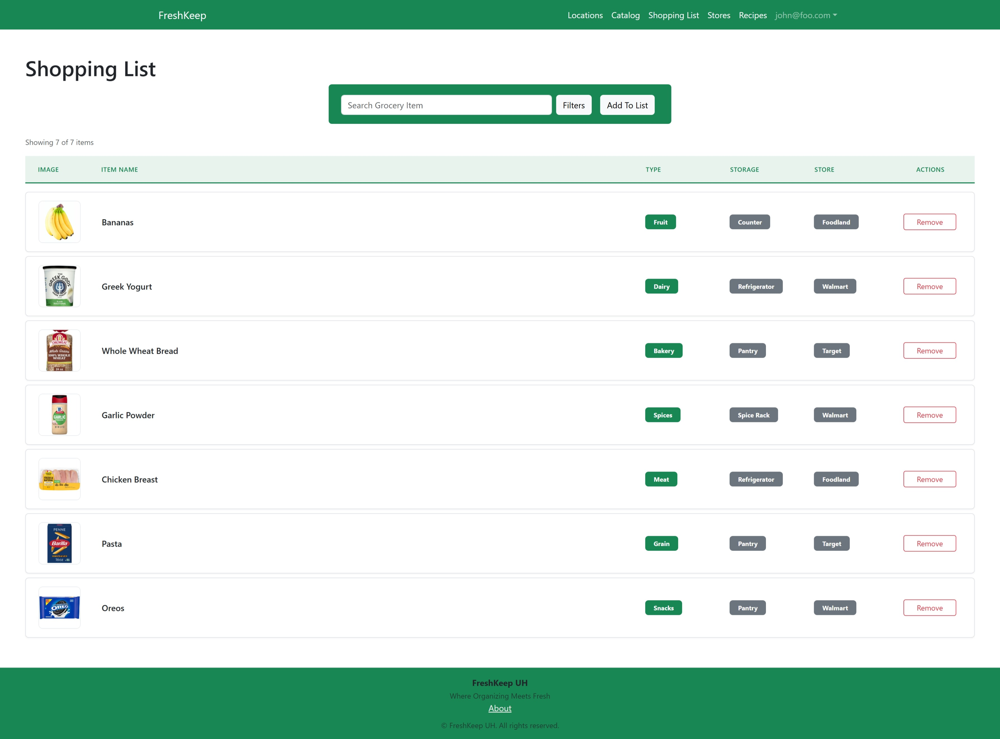
  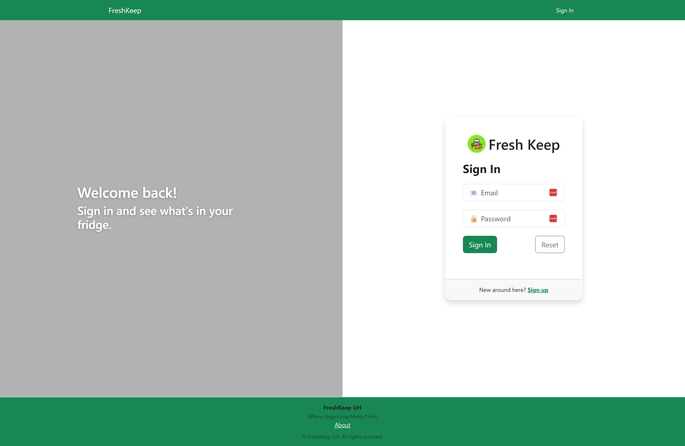
  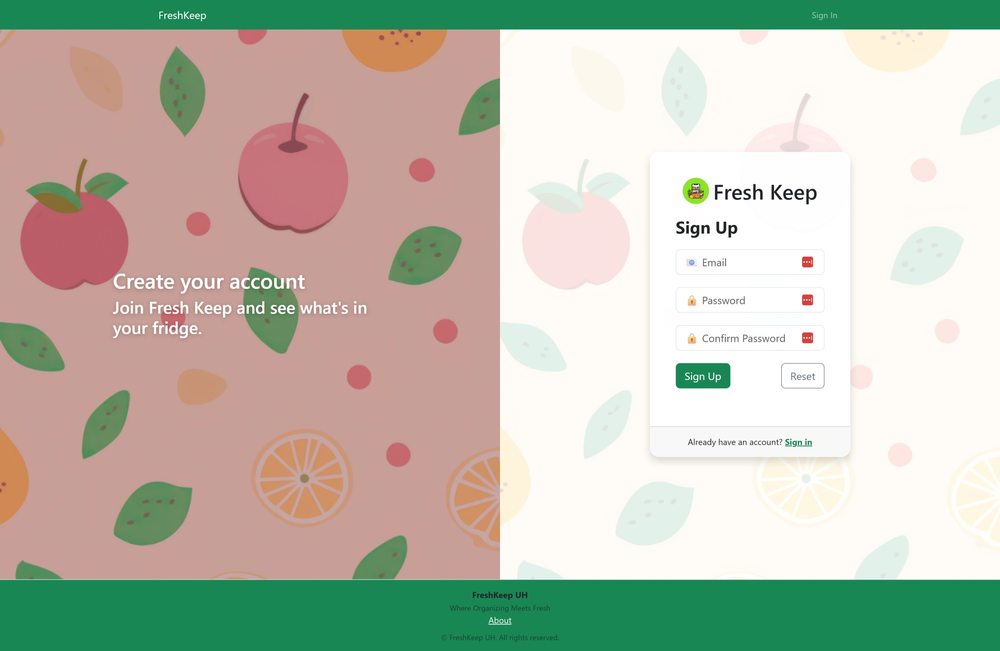
  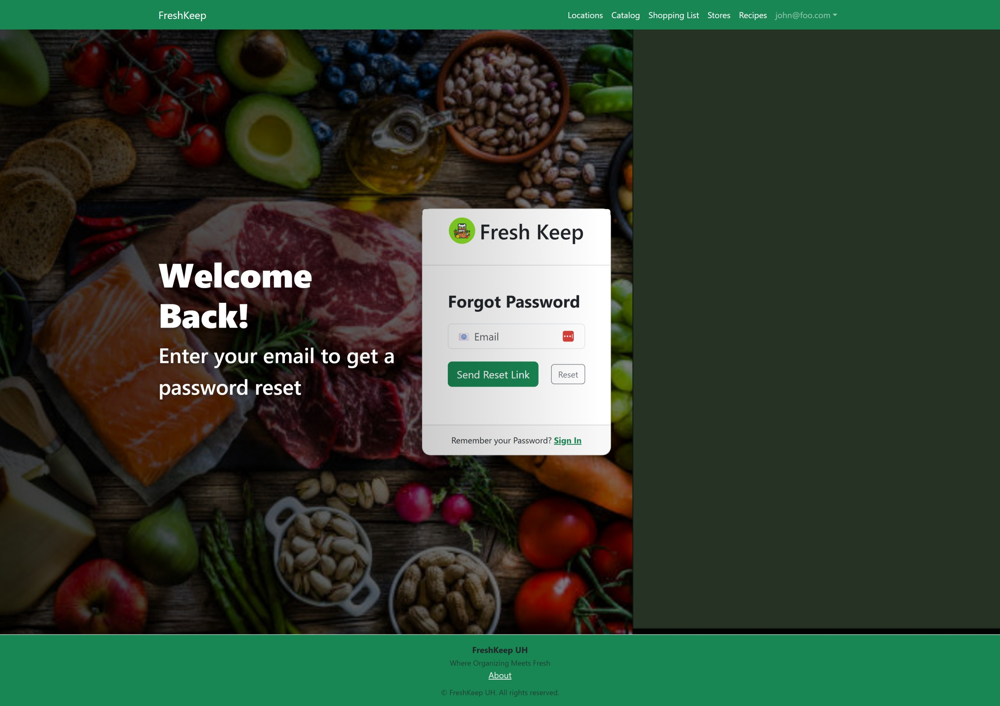
  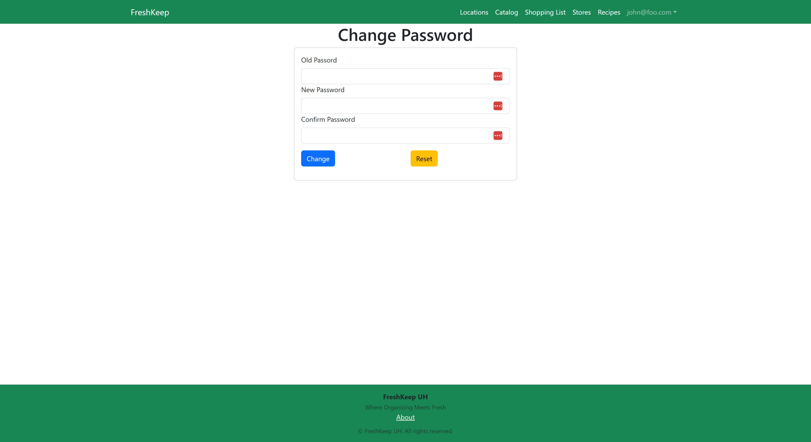
  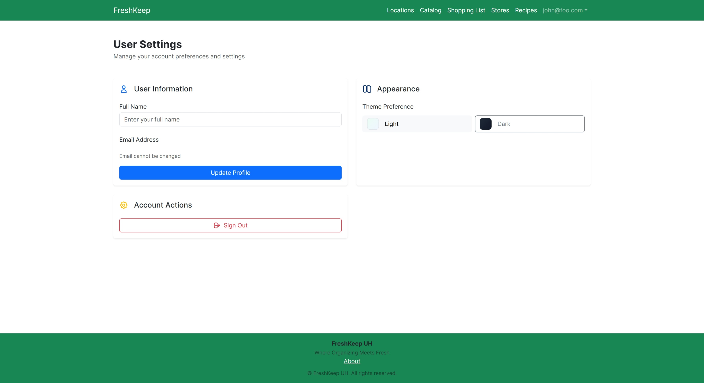
  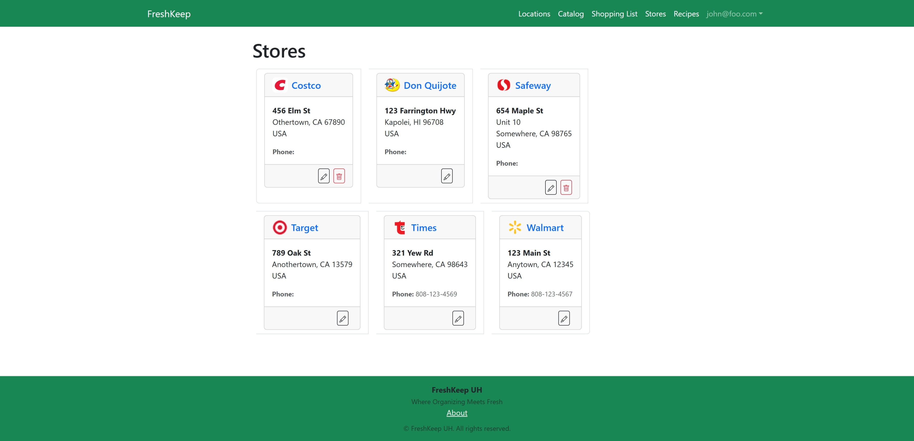
  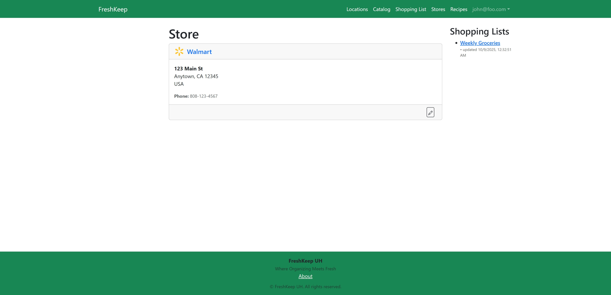
  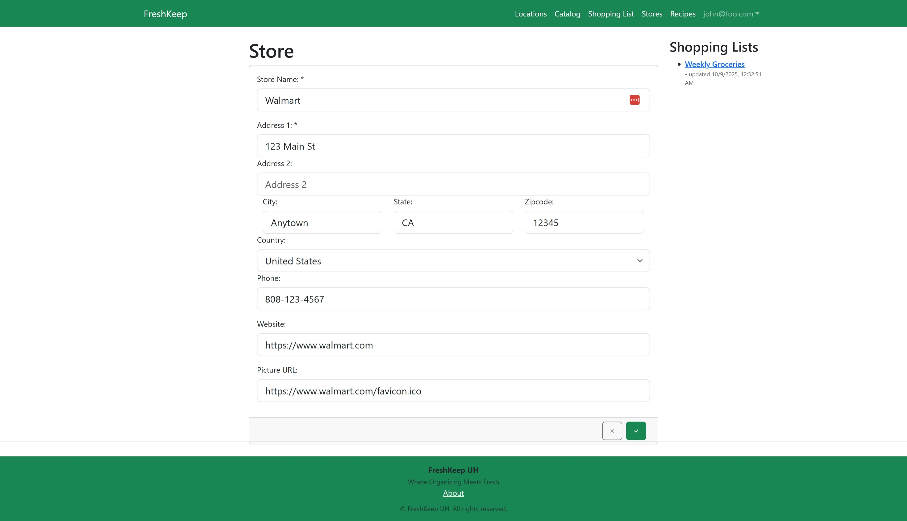
  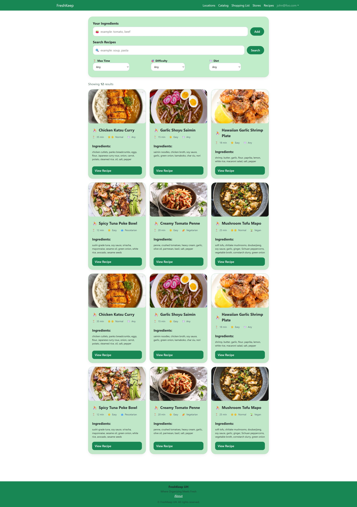
  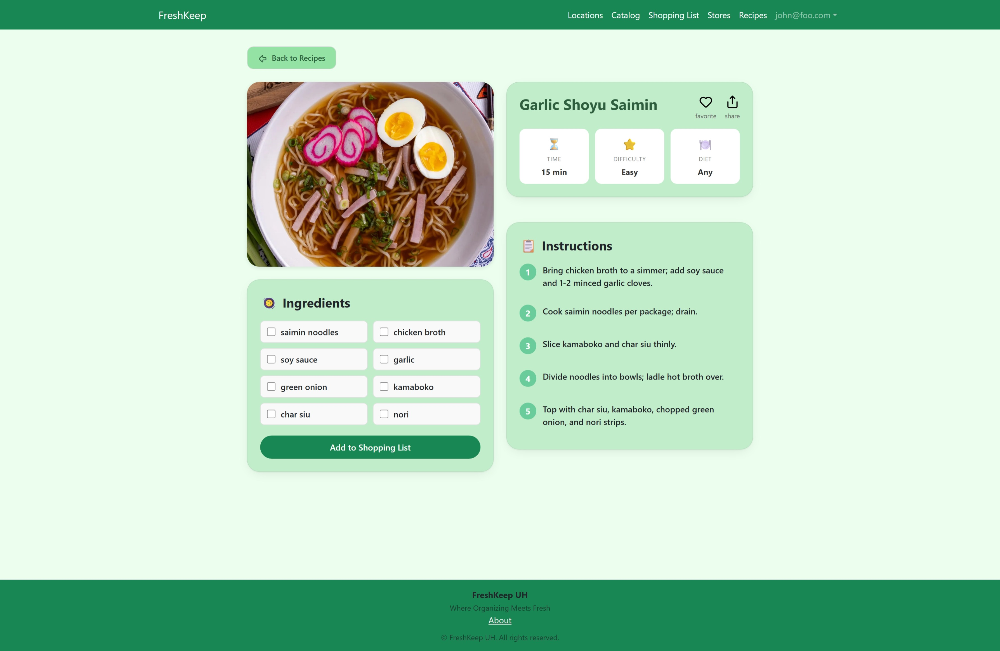

