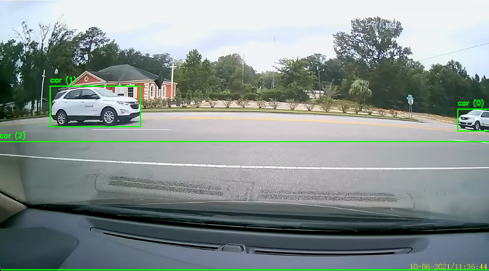
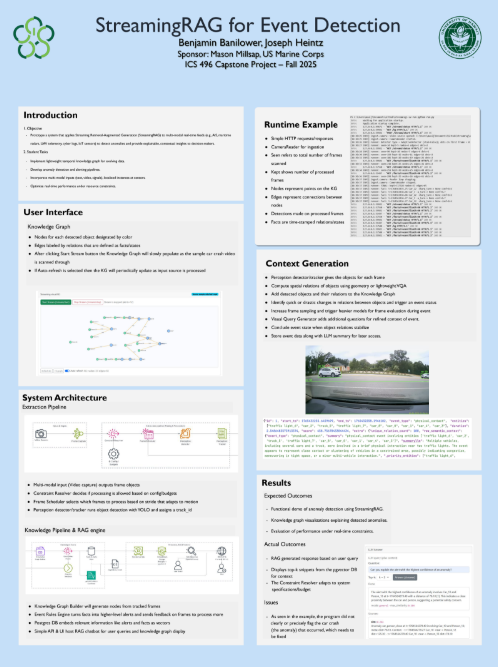

## Overview

StreamingRAG is framed as a single end-to-end system: real-time anomaly detection coupled with a built-in RAG layer for grounded interpretation. In practice, the SRAG-V2 pipeline concepts (stream ingestion, frame scheduling, inference routing, temporal context updates, and knowledge-layer feedback) are treated as part of the StreamingRAG implementation direction and map to the streaming-oriented modules.

At the current milestone level, the strongest demonstrated outcome was detecting a car crash in sample video input while preserving the retrieval-grounded response flow.

Source code repositories:
* [StreamingRAG/streamrag](https://github.com/StreamingRAG/streamrag)
* [StreamingRAG/SRAG-V2](https://github.com/StreamingRAG/SRAG-V2)

## Project Features and Team Work

The project includes the following core capabilities:
* A FastAPI service that serves RAG-based responses and a lightweight web interface for interacting with the system.
* PostgreSQL + pgvector retrieval that enables semantic similarity search over ingested knowledge.
* Dual response behavior (grounded vs. general) with response metadata such as `mode` and `max_similarity` to indicate retrieval confidence.
* Prompt-template routing for grounded and general answer strategies through dedicated prompt files.
* Local model inference via Ollama, enabling privacy-friendly development without reliance on hosted LLM APIs.
* A modular structure with components for ingestion, persistence, pipeline orchestration, and streaming/knowledge workflows.
* An anomaly-analysis pipeline that includes inference, knowledge graph updates, temporal event-state identification, and adaptive question generation, with SRAG-V2 modules serving as the concrete architecture reference integrated into the streaming-side design.

## Project Outcomes

StreamingRAG demonstrates a practical combined architecture rather than two disconnected efforts. It integrates computer-vision signals, temporal reasoning, and retrieval-grounded generation into one iterative pipeline, with car-crash detection in sample footage as a concrete progress milestone.

  

