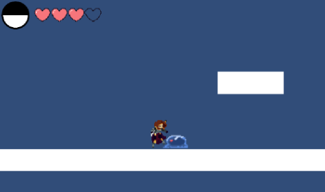
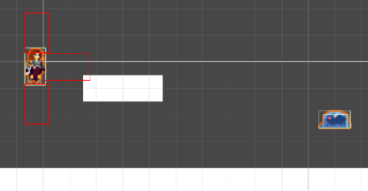
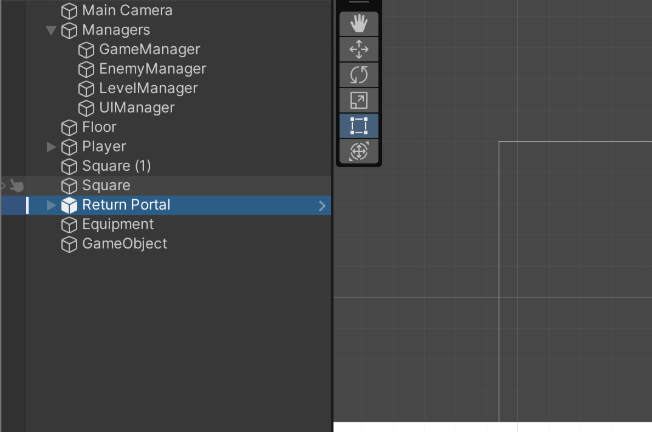
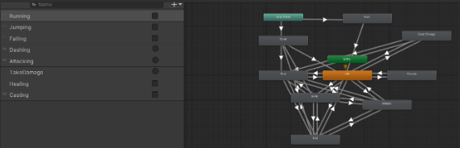

## Overview

Dissonant Worlds is a team-built Unity game project centered on 2D action-platformer exploration across multiple themed worlds. The project combines combat-driven gameplay with progression systems such as teleport hubs, world transitions, save/load persistence, and equipment/inventory management.

A link to the source code repository: [josephheintz/Test-Dissonant-](https://github.com/josephheintz/Test-Dissonant-)

## Project Features and Team Work

The project includes the following core capabilities:
* Multi-scene world design spanning hub, fantasy, hell, ocean, and sci-fi environments with dedicated level scenes.
* Player movement and combat systems implemented in Unity C#, including enemy encounters and boss-related behaviors.
* Enemy and encounter scripting with multiple enemy types (for example slime, skeleton, and cultist variants) and attack/health interactions.
* Teleporter and traversal systems supporting hub-based movement and world progression.
* Inventory and gear foundations with item/equipment scripts and player inventory management.
* Data persistence architecture for saving/loading progression through file-based data handling scripts.
* UI and flow scenes for start, main, credits, win, and lose screens, plus gameplay HUD support.
* Audio and atmosphere systems integrated with level flow for world-specific experience and feedback.

## Project Outcomes

Dissonant Worlds demonstrates a practical team game-development pipeline in Unity, moving from prototype scenes to a structured multi-world project with reusable gameplay systems. The project shows end-to-end integration of core game loops (explore, fight, progress), state persistence, and scene-based progression in a maintainable C# architecture.

  
  
  

