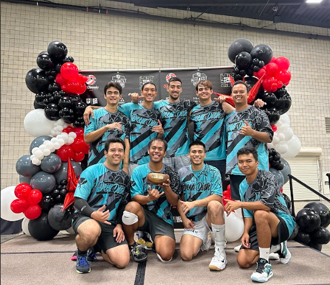

The 5-0 Volleyball tournament is held once a year at the Hawaii Convention Center on Oahu. It is a really big tournament which usually contains local teams and sometimes teams from off-island. This tournament is very well-known among the volleyball community and consists of mens and women's divisions with three sub-divisions labeled from lowest to highest, B's, A's, and open's.

Before this tournament I spent a decent amount of time training and preparing myself for it. My team played in the A's division and we ended up winning the tournament. I played as a middle blocker in that tournament and had several highlights throughtout the entire duration of the event. The front picture of this section is a picture of my entire team right after we won the finals and we stood on a little stage that was setup.
